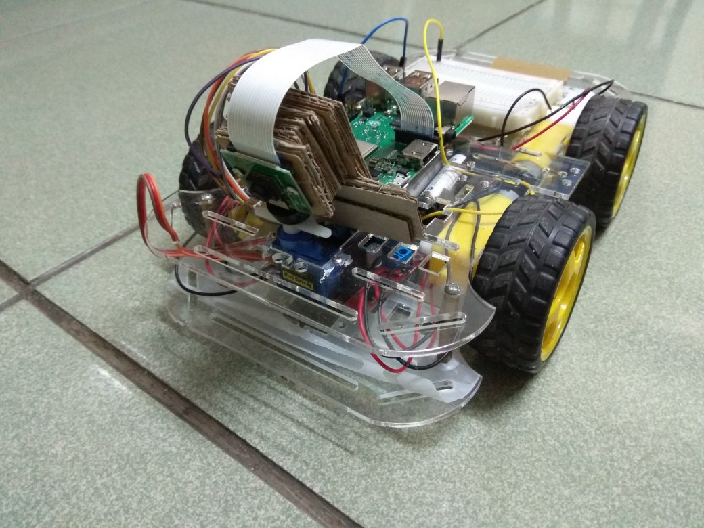

# Raspberry PI X Robotic car X Tensorflow

Here's description about how I build a robotic car using Raspberry PI with car kits and camera, I'll also describe about how I program the car, build/train/validate my neural network for image processing using **Tensorflow C++ API**, I also managed to get 85% accurancy when predicting images of test sets using the trained neural network model.

### Hardware Components
* Raspberry PI 3B+
* Pi camera Rev 1.3
* car chassis kit
* L298N Dual Motor Controller
* DC motors (3-6 Volt.) x 4
* 1.2 Volt. battery x 6

### Software Components
* Raspbian 9 (Stretch) with GCC 6.3.0
* Build shared libraries from sources for our C++ application, this includes :
  * opencv 4.0.0
  * Tensorflow 1.12
  * protobuf 3.6.0
  
please read [How to build shared libraries](build_essential_libraries.md) for detail.

### The track
I decided to build my own track since I couldn't find any existing track in my hometown, it is about 6-7 meters x 4 meters, black lane line with curvatures, due to illumination changes in different time of a day and material of the floor, it could be challenging to accurately predict lane line using traditional computer vision approach.

### Hardware connection

The table below shows how I wired L298N Controller to my Raspberry PI 3B+
 
| L298N | RPi 3B+ |
|-------|---------|
| IN1   | GPIO 17 |
| IN2   | GPIO 27 |
| IN3   | GPIO 22 |
| IN4   | GPIO 23 |
| ENA   | GPIO 3  |
| ENB   | GPIO 4  |

#### Image collection
I wrote a tool in Python for data collection, Here's what it does:
* recording video of my lane lines 
* labeling frames from recorded videos.
* augmenting the image examples with labels.

For recording video, we mounted the camera on chassis, manually moved the car with respect to few driving situations :
* the car perfectly follows the lane line
* the car overshoot the lane line a little bit
* the car overshoot the lane line with sharp angle

To create labeled dataset, my tool extracts each frame from recorded videos to the GUI window, users can click on the frame to specify where the expected centroid of the lane line should be in each frame, then press any key on the keyboard to switch to next frame. On each key event my tool will automatically :
* resize a frame to smaller size 160 x 120
* horizontally flip the small images and the specified point in x-axis (for augmentation)
* saves the frame to image file
* normalize the point (the (x,y) in image coordinate system we just specified for the frame), the normalized (x,y) value will be in the range \[-1, 1\].
* append label information (normalized point & the path of the saved image) to csv file.

I ended up with 10 videos, ~15000 image examples with labels before augmentation, and ~30000 examples after augmentation.

### Why Tensorflow C++ ?
My objective here is to build C++ based neural network application, Tensorflow C++ API seems like the easiest way to do so. A lot of similar examples on the internet descibe that you can get better training/testing result with Tensorflow python API, since many exotic / convenient operations have been implemented there (also many optimizers available), however in my case, I found that TensorFlow python API only improves 3-4% accurancy (~89%) than its C++ API (~85%) with the same dataset, even I applied optimizer at the python side and convolutional layer at the both side I still couldn't get that much improvement. So I choose Tensorflow C++ API.

### Building model & Hyperparameters
In the beginning I tried only 2 fully-connected hidden layers, after some experiment I found following hyperparameters working together just fine :
* input layer size = 1800
  * which means I'll crop a input RGB image from 160 x 120 to 160 x 60, then further downsize the cropped image to 40 x 15, the downsized image has 40 x 15 x 3 = 1800 features to fit in the input layer of the model.
* 1st hidden layer size = 32
* 2nd hidden layer size = 8
* output layer size = 2
  * I expect the model will output a point (x,y) on the image to represent the predicted centroid of lane line, in the range \[-1, 1\].
* Tanh as activation function (excluding the output layer)
  * we want it to be linear output ....
  

I've also tried few different combinations in order to build a neural network model :
* only 2 fully-connected layers 
* 1 convolutional layers + 2 fully-connected layers
* 2 convolutional layers + 2 fully-connected layers

Due to limited resource on Raspberry PI I could not run that complicated structure of neural network like YOLO or ResNet then end up eating up all of CPU/memory resource, it is like the types of layer we can try are limited.

The 3 options listed above provide very similar training error, I apply the first one to my neural network model

### train the model

### save the mode1 to protobuf text file

### save the parameter matrices to checkpoint files

### load the trained model on Raspberry Pi

#### There are still something to improve

