# Raspberry PI X Robotic car X Tensorflow

Here's description about how I build a robotic car using Raspberry PI with chassis kits and camera, also how I build / train / validate my neural network model using **Tensorflow C++ API**, Based on this article, I managed to get 85% accurancy when predicting images from test sets, and trained neural network model can predict centroid of lane line from the captured frames of camera (click the picture below to see the video).


[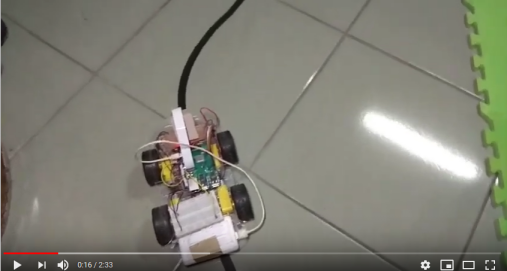](https://www.youtube.com/watch?v=pSG8lJDgizE)


### Hardware Components
* Raspberry PI 3B+
* Pi camera Rev 1.3
* car chassis kit
* L298N Dual Motor Controller
* DC motors (3-6 Volt.) x 4
* 1.2 Volt. battery x 6

### Software Components
* Raspbian 9 (Stretch) with GCC 6.3.0
* Build shared libraries from sources for our C++ application, this includes :
  * opencv 4.0.0
  * Tensorflow 1.12
  * protobuf 3.6.0
  
please read [How to build shared libraries](build_essential_libraries.md) for detail.


### The track
I decided to build my own track since I couldn't find any existing track in my hometown, it is about 6-7 meters x 4 meters, black lane line with curvatures, due to illumination changes in different time of a day and material of the floor, it could be challenging to accurately predict lane line using traditional computer vision approach.

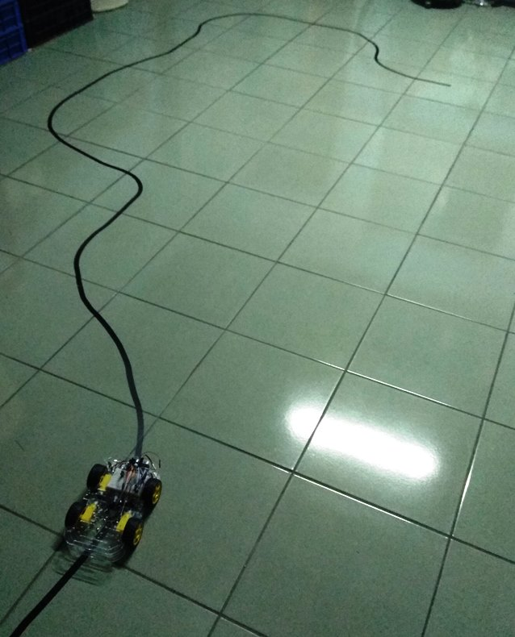


### Hardware connection

The table below shows how I wired L298N Controller to my Raspberry PI 3B+
 
| L298N | RPi 3B+ |
|-------|---------|
| IN1   | GPIO 17 |
| IN2   | GPIO 27 |
| IN3   | GPIO 22 |
| IN4   | GPIO 23 |
| ENA   | GPIO 3  |
| ENB   | GPIO 4  |


#### Image collection
I wrote a tool in Python for data collection, Here's what it does:
* recording video of my lane lines 
* labeling frames from recorded videos.
* augmenting the image examples with labels.

For recording video, we mounted the camera on chassis, manually moved the car with respect to few driving situations :
* the car perfectly follows the lane line
* the car overshoot the lane line a little bit
* the car overshoot the lane line with sharp angle

To create labeled dataset, my tool extracts each frame from recorded videos to the GUI window, users can click on the frame to specify where the expected centroid of the lane line should be in each frame, then press any key on the keyboard to switch to next frame. On each key event my tool will automatically :
* resize a frame to smaller size 160 x 120
* horizontally flip the small images and the specified point in x-axis (for augmentation)
* saves the frame to image file
* normalize the point (the (x,y) in image coordinate system we just specified for the frame), the normalized (x,y) value will be in the range \[-1, 1\].
* append label information (normalized point & the path of the saved image) to csv file.

|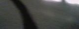|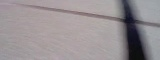|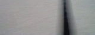|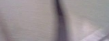|
|----------------------------|----------------------------|----------------------------|----------------------------|
|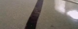|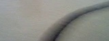|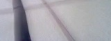|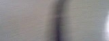|
|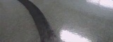|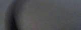|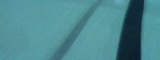|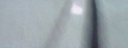|
||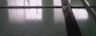|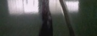||

The table above shows the downsized images which will be fed into our neural network model. I ended up with 10 videos, ~15000 image examples with labels before augmentation, and ~30000 examples after augmentation.


### Why Tensorflow C++ ?
My objective here is to build C++ based neural network application, Tensorflow C++ API seems like the easiest way to do so. A lot of similar examples on the internet descibe that you can get better training/testing result with Tensorflow python API, since many exotic / convenient operations have been implemented there (also many optimizers available), however in my case, I found that TensorFlow python API only improves 3-4% accurancy (~89%) than its C++ API (~85%) with the same dataset, even I applied optimizer at the python side and convolutional layer at the both side I still couldn't get that much improvement. So I choose Tensorflow C++ API.


### Building model & Hyperparameters
In the beginning I applied only 2 fully-connected to the hidden layers of the model, after some experiment I found following hyperparameters working together just fine :
* input layer size = 1800
  * which means I'll crop a input RGB image from 160 x 120 to 160 x 60, then further downsize the cropped image to 40 x 15, the downsized image has 40 x 15 x 3 = 1800 features to fit into the input layer of the model.
* 1st hidden layer size = 32
* 2nd hidden layer size = 8
* output layer size = 2
  * the model will output a pair of (x,y) value, which represents the normalized (x,y) number in the range \[-1, 1\], also means predicted centroid of lane line.
  * note that I treat lane detection as a linear regression problem, NOT like logistic regression & multi-class classification, therefore the output of the model will be linear value (in the range \[-1, 1\]), NOT probability of different positions of centoid of the lane line.
* Tanh as activation function
  * all layers, excluding the output layer, include the activation function, since we are addressing linear regression problem
* initial random value of parameter matrices, ranges from 0 to 0.0011
* learning rate = 0.00004
* lambda for regularization = 0.000001
* 2/3 of the dataset will be used for training, 1/3 of them will be for testing.
  
 
For hidden layer, I also tried few different combinations in the model :
* only 2 fully-connected layers 
* 1 convolutional layer  + 2 fully-connected layers
* 2 convolutional layers + 2 fully-connected layers

Due to limited resource on Raspberry PI, I cannot run that complicated neural network like YOLO or ResNet then end up eating up all of CPU/memory resource, it seems that the types of network layer we can try are limited.

The 3 options listed above provide very similar training errors, I apply the first one to my neural network model.


### Training / Testing Loss, and Accurancy
Before I train the model, I need to determine training / testing loss, and how do I measure accurancy. For each image example of **training set**, we have :

| variable name | description |
|---------------|-------------|
| x_pred | normalized value x predicted by the model |
| y_pred | normalized value y predicted by the model |
| x_true | normalized value x in the label (ground truth) |
| y_true | normalized value y in the label (ground truth) |
```
example_loss = sqrt( (x_pred - x_true)^2 + (y_pred - y_true)^2 );
total_loss = sum(example_loss) + lambda * sum( all_train_parameters ^ 2 );
```

Here is how I determine prediction accurancy, for each image example of **testing set** : 
```
accurate_pred = 
                 1, means the prediction is considered accurate, 
                    if abs(x_pred - x_true) < 0.25  and  abs(y_pred - y_true) < 0.37
                 0, otherwise

accurancy = sum(accurate_pred) / num_of_examples_testset
```


### Training the model
I trained the model a few times on a dual-core intel i5 laptop, each time it took about 3 hrs.

In the beginning, we found the training losses can vary widely, e.g. we got previous training loss = 0.06 while current training loss = 0.120 , it turns out the reason could be skewed training set, since every time we randomly chose image examples from the entire dataset for training process, sometimes we were lucky to get a training set covering almost all kinds of lane-line conditions, while sometimes we got a training set covering only a few types of lane condition (e.g. the lanes are always in the middle in our training set).

To avoid inbalanced training/test set , we tried grouping the dataset by the similar lane-line situation, using k-mean cluster algorithm (with k = 60), then check if we need to add more images of specific types. (e.g. lack of image example with sharp left curvature ...... etc) 

After this procedure the training processes works more stable, I managed to get trainning loss between 0.06 ~ 0.08, and 85% ~ 87% accurancy when predicting images from testing set using the trained neural network model


### Save the model to protobuf text file
We can make use of Tensorflow C++ function ```tensorflow::WriteTextProto()``` to save the graph to protobuf-format text/binary file. To invoke this function you must prepare few arguments :
* ``` tensorflow::Env ``` object, created by static function ```tensorflow::Env::Default()```
* string path to the protobuf file, it can be ```std::string```
* get the object ```tensorflow::GraphDef```  from ```tensorflow::Scope::ToGraphDef()``` after you defined all the operations in the object ```tensorflow::Scope``` 


### Save the parameter matrices to checkpoint files
A checkpoint in tensorflow framework is like a trained parameter matrix, ```tensorflow::WriteTextProto()``` will NOT save trained parameters to protobuf file, fortunately we have ```tensorflow::checkpoint::TensorSliceWriter``` instead, to do so you must do the following :
* get currently trained parameters by performing this:
  ```
  tensorflow::Session::Run({}, {"name_of_param_mtx"}, {}, &output_tensor)
  ```
  while output_tensor is a ```std::vector``` of ```tensorflow::Tensor``` with 6 elements (Tensors).
* copy raw data from each of ```tensorflow::Tensor``` to ```tensorflow::checkpoint::TensorSliceWriter```, you must prepare:
  * base address of the parameter raw data by calling ```tensorflow::Tensor.tensor_data().data()```
  * shape of each ```tensorflow::Tensor``` , by calling ```tensorflow::Tensor::dim_size(NUM_DIMENSION)```. For eaxmple a 7x17 2D parameter matrix, NUM_DIMENSION can be 0 and 1, where ```tensorflow::Tensor::dim_size(0)``` is 7 and ```tensorflow::Tensor::dim_size(1)``` is 17.
  * name of this checkpoint, naming must be unique from other checkpoints
  * create an object ```tensorflow::TensorSlice``` by calling ```tensorflow::TensorSlice::ParseOrDie("-:-")```, it seems that the only argument of ```tensorflow::TensorSlice::ParseOrDie``` will be internally analyzed e.g. ```-:-``` means taking all items of a matrix. if users only want part of trained parameter matrix e.g. to only take 2nd column of all rows, then the string argument would be likely ```-:2``` , I haven't figured out such advanced uasge of ```tensorflow::TensorSlice::ParseOrDie```.


### Load the trained model on Raspberry PI
To load tensorflow graph model & corresponding trained parameters, you have ```tensorflow::ReadTextProto``` and ```tensorflow::checkpoint::TensorSliceReader```
* the usage of ```tensorflow::ReadTextProto``` is quite similar to ```tensorflow::WriteTextProto()```, please check out [models::restore_from_file()](src/models.cc#L534) in this repository.
* To load trained parameters to the model, using ```tensorflow::checkpoint::TensorSliceReader``` , you need to :
  * before you train the model, make sure to create ```tensorflow::ops::Placeholder``` as the entry to parameter matrices inside neural network model, then create ```tensorflow::ops::Assign``` to define the operation that assigns the value from ```tensorflow::ops::Placeholder``` to the parameter matrices in ```tensorflow::ops::Variable``` of the neural network model.


### PID control


### Get it all together
My lane-line application code can be briefly seperated to 2 parts, managed by 2 different threads, one is for always polling the camera to see any captured new frame comes out, while the other one is to take the new captured frame, pre-process it, and feed it into our trained neural network model. It works well as shown in following clip :

[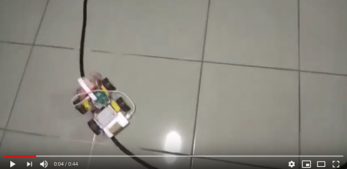](https://www.youtube.com/watch?v=RRzkYEv9kbw)


#### There are still something to improve
* the prediction is not 100% accurate 
* speed issue
* need more efficient way to group dataset for training / validation / test procedures


